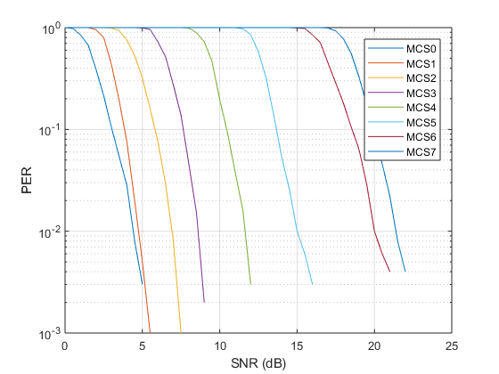

# ubx-v2x
## V2X baseband simulation model

ubx-v2x is a simulation model of a baseband 802.11p transceiver which can be used for research on V2X communications. It provides a reference implementation of all the mandatory transmitter and receiver processing blocks. It also includes implementations of the V2V channel models summarized in [1], originating from test trials described in [2-4].

## Introduction

The goal of ubx-v2x is to stimulate research on algorithms for current and next-generation V2X communications systems. The main advantage of this model compared to existing 802.11 implementations is the provision of a channel tracking mechanism which is crucial in investigating high-mobility scenarios.

## Quick Start

Use `batch_sim` to initiate a Monte-Carlo simulation which goes through MCS 0-7 and SNR levels from 0 to 25 dB.

<div align="center">
  
  <p>Example PER vs SNR results for an AWGN channel.</p>
</div>

## MEX Acceleration (optional)

Simulation performance can be significantly improved by using (compiled) MEX files for the high-level transmitter `sim_tx` and receiver `sim_rx` functions. These functions and the ones below them have been written in a way which enables code generation as described [here](https://www.mathworks.com/help/comm/ug/code-generation-from-matlab.html).

Compilation of the MEX files for your platform can be performed by executing `codegen_script` from the top-level directory. Once the MEX files are created inside the `mex` folder, MEX-acceleration can be enabled by setting `SIM.use_mex = true;` at the top of `batch_sim`.

## Requirements

ubx-v2x requires the following software from The MathWorks, Inc.

- MATLAB
- Signal Processing Toolbox
- Communications System Toolbox
- MATLAB Coder (optional, for MEX generation only)

A supported compiler is also needed for MEX acceleration, as specified [here](https://www.mathworks.com/support/compilers.html).

## License

See [LICENSE](https://github.com/u-blox/ubx-v2x/blob/master/LICENSE.md) for the terms associated with this release.

## Citing ubx-v2x

If you use ubx-v2x in your research, please use the following BibTeX entry.

```
@misc{ubx-v2x,
  author =       {Ioannis Sarris},
  title =        {ubx-v2x},
  howpublished = {\url{https://github.com//u-blox//ubx-v2x}},
  year =         {2018}
}
```

## References

[1] M. Kahn, "IEEE 802.11 Regulatory SC DSRC Coexistence Tiger Team V2V Radio Channel Models," [IEEE 802.11-14/0259r0](https://mentor.ieee.org/802.11/dcn/14/11-14-0259-00-0reg-v2v-radio-channel-models.ppt).

[2] I. Tan, W. Tang, K. Laberteaux and A. Bahai, "Measurement and Analysis of Wireless Channel Impairments in DSRC Vehicular Communications," 2008 IEEE International Conference on Communications, Beijing, 2008, pp. 4882-4888.

[3] P. Alexander, D. Haley and A. Grant, "Cooperative Intelligent Transport Systems: 5.9-GHz Field Trials," in Proceedings of the IEEE, vol. 99, no. 7, pp. 1213-1235, July 2011.

[4] L. Bernadó, T. Zemen, F. Tufvesson, A. F. Molisch and C. F. Mecklenbräuker, "Delay and Doppler Spreads of Nonstationary Vehicular Channels for Safety-Relevant Scenarios," in IEEE Transactions on Vehicular Technology, vol. 63, no. 1, pp. 82-93, Jan. 2014.